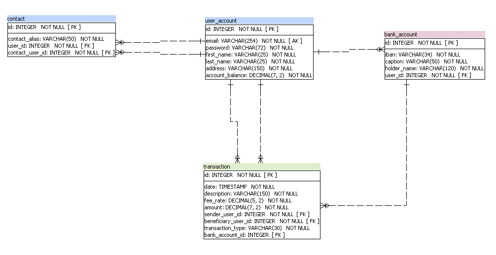

# PayMyBuddy - Money Transfer application
Application that easily allows user to make money transaction between 2 users.
We can also make withdrawals and deposit between our bank account and PayMyBuddy account.

## Documentation
#### Class diagram

#### Physical Data Model

### Pre-requisites

- Java 1.8
- MySQL 8.0 or greater
- Maven 3.5.2

### Install

Create a MySQL database named paymybuddy
Run `src/java/resources/static/DDL.sql` to create tables

Run `mvn clean install`

## Running

Run `mvn spring-boot:run` to launch the application

Go to http://localhost:8080/

Run `mvn spring-boot:stop` to stop the application